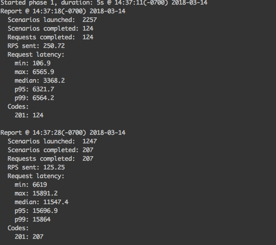
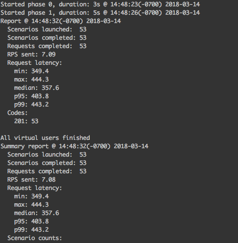

# 43 Artillery Load Testing

This repository contains files to test a local and deployed API. The local test file `local-complex-load-test` contains test that break the localhost API. `local-max-load-test` contains test that reach maximum limits to the local API. The deployed API is also tested with `heroku-max-load-test`, these tests are much more simple due to Heroku's limitations on a free account.

[Link to Heroku app](https://melanie-401d21-19-deployment.herokuapp.com)

While the local tests are able to handle more users than the deployed application, the latency of both were significant beyond 20 users per second. If I were to market this API to the general public, I would probably need more servers and perhaps more efficient code to handle this load.

Latency examples from local testing:

Latency examples from Heroku deployed app:

